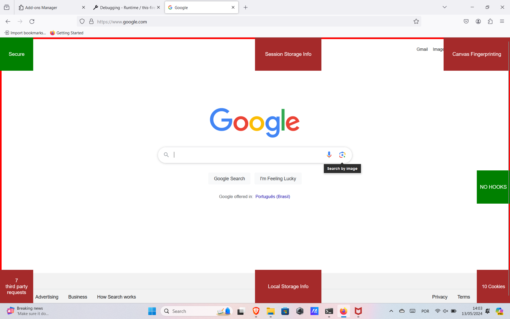
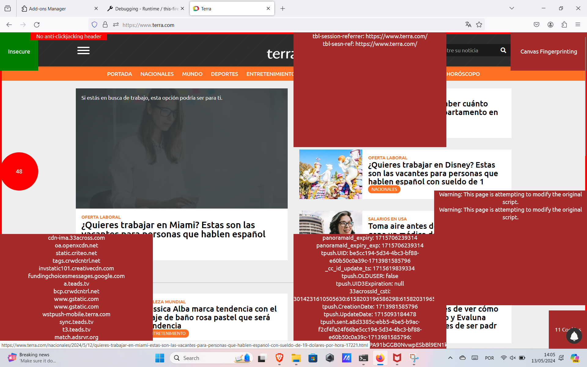
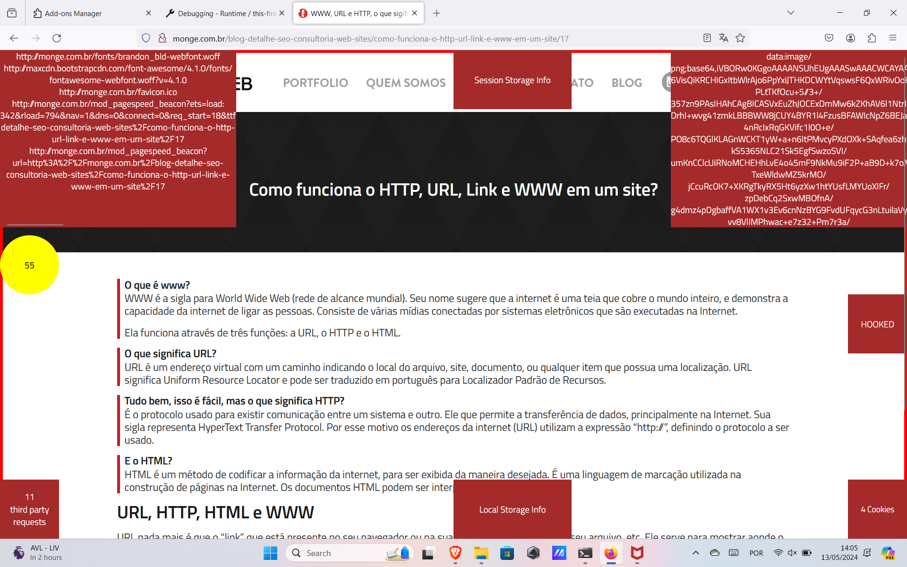

# privacy_plugin

## plugin normal

## Exemplo de uso

O circulo presente nas telas é que após 10 segundos recebe uma nota de privacidade do site

<h3> visão de cookies, sessison storage, hook e request de terceiros</h3>

<h3> visão de seguranca http e canvas fingerprint</h3>

<h3> Verificando anti-click hijacking header</h3>

